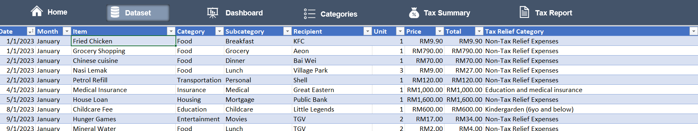
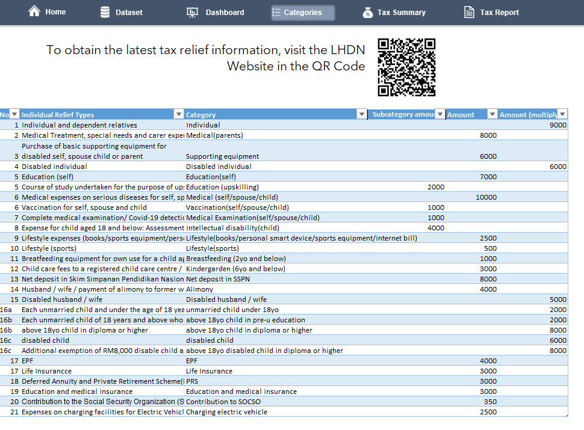
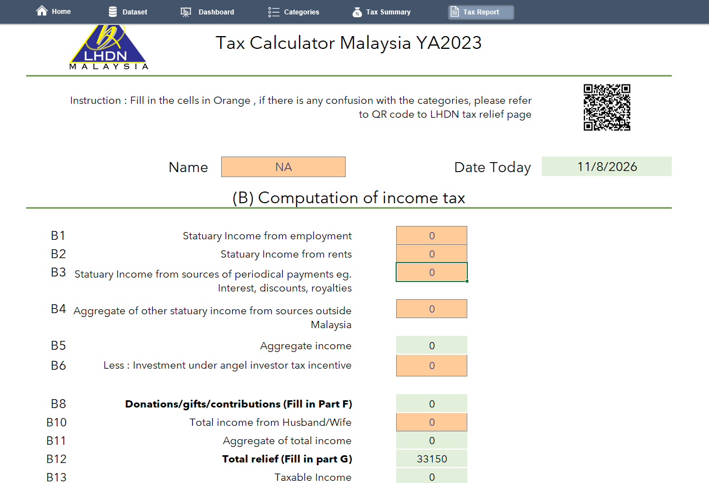
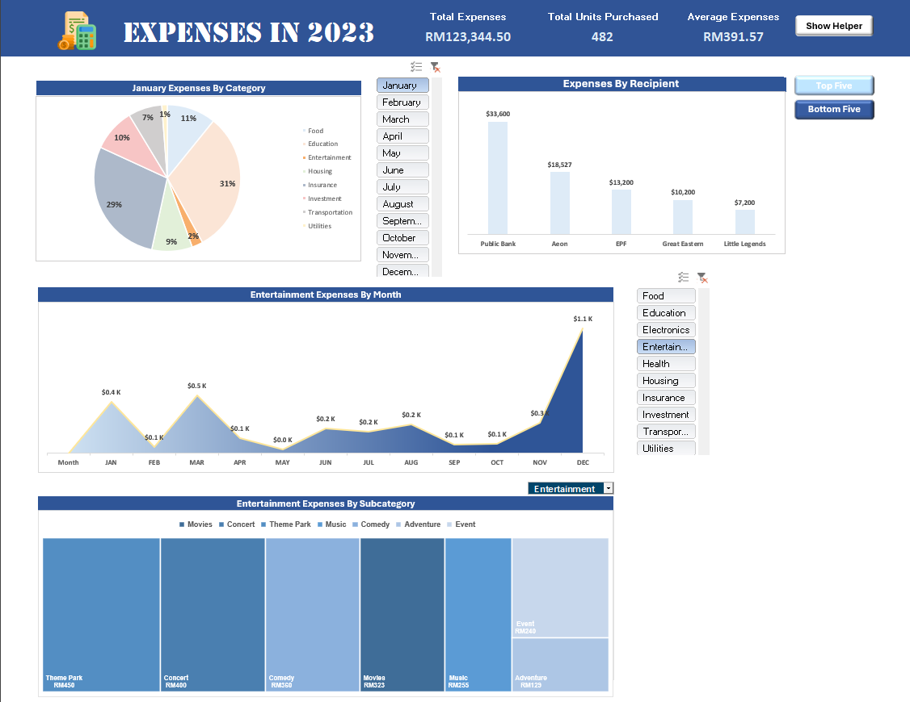

# Malaysia Personal Tax & Expense Calculator (YA2023) — Excel/VBA

A macro-enabled Excel workbook that turns a personal expense log into a full LHDN-style
(Malaysian tax authority) income tax computation — built to explore advanced Excel and VBA
capabilities beyond formulas: dynamic forms, pivot-driven dashboards, and one-click reporting.

## What it does

1. **Log expenses** in a structured dataset (date, item, category, subcategory, recipient,
   total price, and tax-relief category).
   
2. ** Auto-categorise ** each expense against Malaysia's official LHDN tax-relief categories
   and their statutory caps (e.g. Lifestyle RM2,500, Medical RM10,000, EPF, SSPN, etc.).
   
3. **Compute tax liability** using the official YA2023 tax computation structure (aggregate
   income → total relief → taxable income → tax payable → rebates → balance payable),
   pulling relief totals straight from the categorised expense log.
    
4. ** Visualize spend** via an interactive dashboard with KPI summaries, category and monthly
   trend charts, a Top 5 / Bottom 5 recipient view, and a subcategory drill-down — all filterable by month and category.
   
5. **Export** the Tax Report, Tax Summary, or Input Form as a ready-to-file PDF with a
   single button click.

## Features

- **12 interconnected sheets**: Home (nav), Expenses dataset, Categories reference tables,
  Pivot Tables, Dashboard, Tax Report Calculator, Tax Summary, Tax Calculator, Input Form.
- **VBA automation** (see [`vba_modules/`](vba_modules)):
  - Kiosk-style UX on open — hides ribbon/formula bar/sheet tabs, locks per-sheet scroll areas
  - Dynamic form logic — filing-status changes (Single/Married/Divorced) show/hide and
    re-validate dependent fields in real time
  - One-click PDF export of the Tax Report, Tax Summary, and Input Form
  - Pivot table control — Top 5 / Bottom 5 recipient filtering via buttons
  - Password-protected sheet locking/unlocking to prevent accidental edits to formulas
- **Data validation & conditional formatting** throughout input cells
- **318-row sample expense dataset** (synthetic) to demonstrate the full workflow end to end

## Tech used

Excel (formulas, pivot tables, slicers, data validation, conditional formatting, form
controls) + VBA (event-driven macros, PivotTable/Slicer API, PDF export via
`ExportAsFixedFormat`).

## Repo contents

```
Project.xlsm     # the workbook itself
vba_modules/     # VBA source extracted to plain text for readability/version control
images           # screenshots to demonstrate the features
README.md
```

Since `.xlsm` is a binary format, the VBA source is also extracted into `vba_modules/` as
plain `.cls`/`.bas` files so the logic is readable directly on GitHub without opening Excel.

## How to use

1. Download `Project.xlsm` and open in Excel (enable macros).
2. Enter your expenses in the **Expenses (2023)** sheet, tagging each with a Tax Relief
   Category from the **Categories** sheet.
3. Fill in the orange input cells in **Tax Report Calculator** / **Input Form**.
4. View the computed tax liability in **Tax Summary**, or export a PDF via the button.

## Authors

- Pang Kou Yi, http://www.linkedin.com/in/pang-kou-yi
- Gan Wei Hang

## Disclaimer

Built as a personal tool for illustrative purposes — not certified tax software. Tax rules
change yearly; verify figures against the official LHDN guidelines before filing.
